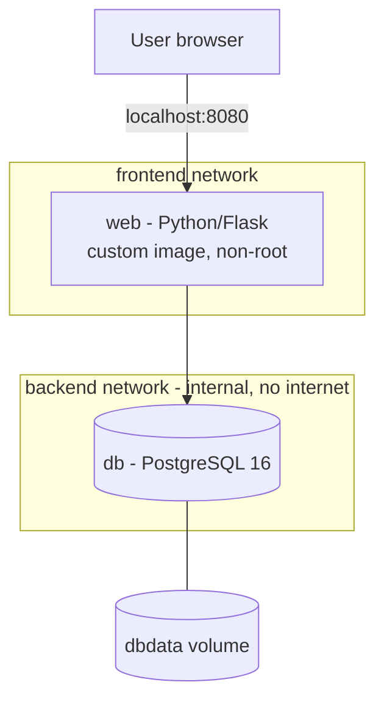

# IT Asset Register: Containerised Two-Tier Web App


A small internal IT tool for tracking devices (laptops, monitors, phones) and who they are assigned to. I built it as a hands-on project to learn **Docker** properly: writing my own image, running a multi-container application with **Docker Compose**, segmenting container networks, keeping data persistent, and automating image builds with **GitHub Actions**.

The same image was later deployed to Azure with Terraform. See [Where this went next](#where-this-went-next).

**Requires:** Docker Desktop and Git. See [Prerequisites](#prerequisites).


## What this project demonstrates

| Area | Implementation |
|---|---|
| **Custom images** | Dockerfile with dependency layer caching, slim base image, pinned versions |
| **Multi-container apps** | Docker Compose defining the app, database, networks and volumes |
| **Network segmentation** | Database on an `internal` network with no internet access and no published ports |
| **Persistent storage** | Named volume; data survives container rebuilds and redeployments |
| **Security** | App runs as a non-root user; secrets kept in `.env` (excluded from Git and the image); port bound to localhost only |
| **Reliability** | Health checks on both services; the app waits for the database to be healthy; restart policies |
| **Resource control** | Memory limits on each container |
| **CI/CD** | GitHub Actions builds the image and publishes it to GitHub Container Registry on every push, tagged by commit |

---

## What is Docker?

Docker packages an application together with everything it needs to run (its code, runtime, libraries and settings) into a single standard unit called a **container image**. That image runs the same way on a laptop, a test server or in the cloud, because it brings its own environment with it rather than relying on what is installed on the machine.

A few terms used throughout this project:

| Term | Meaning |
|---|---|
| **Image** | A read-only template, built from a Dockerfile. Comparable to a reference image used for building PCs |
| **Container** | A running copy of an image. Many containers can run from one image |
| **Dockerfile** | The recipe for building an image, kept as a text file in Git |
| **Docker Compose** | Defines and runs several containers together from one file |
| **Volume** | Storage that lives outside a container, so data survives when the container is replaced |
| **Registry** | Where images are stored and shared, such as Docker Hub or GitHub Container Registry |

### Containers compared with virtual machines

| | Virtual machine | Container |
|---|---|---|
| Contains | A full operating system plus the app | The app and its libraries only |
| Size | Gigabytes | Megabytes |
| Start time | Minutes | Seconds |
| Isolation | Strong, with its own kernel | Good, but shares the host's kernel |

Containers are isolated processes rather than small virtual machines. Linux **namespaces** control what a container can see (its own processes, network and files), and **cgroups** control how much CPU and memory it can use. In practice the two are used together: on Windows, Docker Desktop runs containers inside a lightweight Linux VM, and in Azure, Kubernetes nodes are VMs running containers.

### Why organisations use it

- **Consistency:** the same image runs in development, test and production, which removes the "it works on my machine" problem.
- **Speed:** containers start in seconds, so environments can be created and replaced quickly.
- **Efficiency:** many containers can share one host, as each one does not carry a full operating system.
- **Isolation:** applications with conflicting dependencies can run side by side.
- **Repeatability:** the Dockerfile and Compose file are text in Git, so the environment is documented, reviewable and versioned.
- **CI/CD:** every code change can be built into an image, tested and deployed automatically.

### When it is not the right fit

Containers are not a replacement for everything. Desktop applications, workloads that need a full operating system (such as a domain controller), and some legacy Windows applications are still better suited to virtual machines or traditional deployment.

---

## Why I built this

Most of my work has been hands-on infrastructure: domain migrations, hybrid identity, Intune rollouts and estate rebuilds. A recurring theme has been environments that are meant to be identical but slowly drift apart, such as a gold build image going out of date while the machines built from it diverge, or having to test an application specifically inside Citrix because the environment it runs in changes how it behaves.

Docker addresses exactly that problem: the environment is defined in a file and rebuilt identically every time. I wanted to learn it by building something realistic rather than only running sample images, so I built a small IT tool with a web front end and a database, and applied the practices I would expect in a production setting.

## Architecture



- **web** is built from my own Dockerfile. It sits on both networks, so it can be reached from the browser and can reach the database.
- **db** runs the official PostgreSQL 16 image. It sits only on the `backend` network, which is marked `internal`, so it has no internet access and is not reachable from outside.
- **dbdata** is a named volume holding the database files, so data survives when containers are removed and recreated.

---

## Prerequisites

| Requirement | Version used | Purpose | Install (Windows) |
|---|---|---|---|
| Docker Desktop | 29.x | Builds and runs the containers | [docker.com/products/docker-desktop](https://www.docker.com/products/docker-desktop/) |
| WSL 2 | Latest | The Linux environment Docker Desktop uses on Windows | `wsl --install` in PowerShell as Administrator, then restart |
| Git | 2.x | Clones this repository | `winget install --id Git.Git -e` |
| VS Code | Latest (optional) | Editing the files | `winget install --id Microsoft.VisualStudioCode -e` |

> After installing, close and reopen PowerShell so the new commands are recognised.

**Docker Desktop must be open and running** before any `docker` command will work. The bottom-left corner of Docker Desktop shows **Engine running** when it is ready.

**Running on an 8 GB laptop.** I built this on a laptop with 8 GB of RAM. It runs comfortably, as the containers are memory-limited (128 MB for the app and 256 MB for the database), but it helps to close browser tabs and other heavy applications first, and to quit Docker Desktop when finished so Windows gets the memory back.

---

## How I built it

### Project files

| File | Purpose |
|---|---|
| `app.py` | The Flask web application |
| `requirements.txt` | Python libraries the app needs, with pinned versions |
| `Dockerfile` | The recipe for building the app's image |
| `.dockerignore` | Files that must never be copied into the image |
| `compose.yaml` | Defines both containers, the networks and the volume |
| `.env.example` | A template for the settings file, with placeholder values |
| `.gitignore` | Files that must never be committed, including the real `.env` |
| `.github/workflows/docker-build.yml` | The GitHub Actions pipeline |

### The application

`app.py` is a small Flask app with three routes: list assets, add an asset and delete an asset, plus a `/health` route used for health checks. A few details that matter for running it in containers:

- **Settings come from environment variables** (`DB_HOST`, `DB_NAME`, `DB_USER`, `DB_PASSWORD`), so the same image can be pointed at any database without being rebuilt.
- **It retries the database connection** up to 10 times on start-up, in case the database is still starting.
- **It creates its table on first start** if it does not already exist.
- **It listens on `0.0.0.0`**, not `127.0.0.1`. An app listening only on localhost inside a container cannot be reached from outside it, even with ports published.
- **User input is escaped** before being displayed, so text entered into the form cannot inject HTML.

The application is deliberately minimal. The aim of the project is how it is packaged, secured, networked and deployed.

### The Dockerfile

```dockerfile
FROM python:3.12-slim
WORKDIR /app

COPY requirements.txt .
RUN pip install --no-cache-dir -r requirements.txt

COPY app.py .

RUN useradd --create-home appuser
USER appuser

EXPOSE 5000
HEALTHCHECK --interval=15s --timeout=3s --start-period=10s \
  CMD python -c "import urllib.request; urllib.request.urlopen('http://localhost:5000/health')" || exit 1

CMD ["python", "app.py"]
```

| Decision | Why |
|---|---|
| `python:3.12-slim` | A small, pinned base image rather than `latest`, so builds are predictable |
| `requirements.txt` copied and installed **before** `app.py` | Docker caches each layer. Dependencies change rarely, so this layer is reused, and a code change only rebuilds the final `COPY` step. Rebuilds take seconds rather than minutes |
| `--no-cache-dir` | Keeps pip's download cache out of the image, making it smaller |
| `useradd` and `USER appuser` | The app runs as a normal user, not root. If the app were compromised, the attacker would not have admin rights inside the container |
| `HEALTHCHECK` | Docker checks `/health` every 15 seconds and marks the container healthy or unhealthy |
| `CMD` in exec form (`["python", "app.py"]`) | The app becomes the main process, so it receives the stop signal and shuts down cleanly |

### Keeping secrets out of the image and out of Git

`.dockerignore` stops files being copied into the image:

```
.env
*.log
__pycache__
```

`.gitignore` stops files being committed:

```
.env
__pycache__/
*.log
```

The real database password lives only in `.env` on my machine. The repository contains `.env.example` instead, with a placeholder, so anyone can see which settings are needed without seeing mine:

```
POSTGRES_DB=assets
POSTGRES_USER=assetapp
POSTGRES_PASSWORD=change-me
```

### The Compose file

```yaml
services:
  web:
    build: .
    ports:
      - "127.0.0.1:8080:5000"
    environment:
      DB_HOST: db
      DB_NAME: ${POSTGRES_DB}
      DB_USER: ${POSTGRES_USER}
      DB_PASSWORD: ${POSTGRES_PASSWORD}
    depends_on:
      db:
        condition: service_healthy
    networks: [frontend, backend]
    restart: unless-stopped
    mem_limit: 128m

  db:
    image: postgres:16-alpine
    environment:
      POSTGRES_DB: ${POSTGRES_DB}
      POSTGRES_USER: ${POSTGRES_USER}
      POSTGRES_PASSWORD: ${POSTGRES_PASSWORD}
    volumes:
      - dbdata:/var/lib/postgresql/data
    healthcheck:
      test: ["CMD-SHELL", "pg_isready -U $${POSTGRES_USER} -d $${POSTGRES_DB}"]
      interval: 5s
      timeout: 3s
      retries: 10
    networks: [backend]
    restart: unless-stopped
    mem_limit: 256m

networks:
  frontend:
  backend:
    internal: true

volumes:
  dbdata:
```

| Setting | Why |
|---|---|
| `"127.0.0.1:8080:5000"` | Publishes the app on port 8080 **of my own machine only**. A plain `8080:5000` would listen on every network interface, so other devices on the same Wi-Fi could connect |
| `DB_HOST: db` | Compose provides built-in DNS, so the app finds the database by its service name rather than an IP address that changes |
| `${POSTGRES_PASSWORD}` | Values are read from `.env`, so no password is written in the Compose file |
| `depends_on` with `service_healthy` | The app waits until the database passes its health check, not just until its container has started |
| `internal: true` on `backend` | The database network has no route to the internet |
| No `ports` on `db` | The database cannot be reached from outside the Docker network at all |
| `dbdata` volume | Database files are stored outside the container |
| `restart: unless-stopped` | Containers restart after a crash or reboot, unless I stopped them deliberately |
| `mem_limit` | Caps memory use, so one container cannot starve the other or the host |

---

## Running it yourself

Make sure Docker Desktop is open and shows **Engine running**. Run each line separately in PowerShell.

Clone the repository:

```powershell
git clone https://github.com/iM-MQ/docker-asset-register.git
```

```powershell
cd docker-asset-register
```

Create your own settings file from the template:

```powershell
Copy-Item .env.example .env
```

Open it and set your own password, then save and close:

```powershell
notepad .env
```

Build and start everything:

```powershell
docker compose up -d --build
```

The first run takes a minute or two while it downloads the Python and PostgreSQL images. Check both containers are healthy:

```powershell
docker compose ps
```

Wait until both show `(healthy)`, then open **http://localhost:8080** in your browser.

When you have finished:

```powershell
docker compose stop
```

---

## Tests I carried out

### Test 1: Data survives the containers being removed

I added some test assets, then removed and recreated both containers:

```powershell
docker compose down
```

```powershell
docker compose up -d
```

After refreshing the page, all the assets were still there. The containers were deleted and replaced, but the data lives in the `dbdata` volume.

### Test 2: The database cannot reach the internet

```powershell
docker compose exec db ping -c 2 -W 2 8.8.8.8
```

The ping failed. The database is on the `internal` backend network, which has no route out, so even if the database container were compromised it could not send data anywhere.

### Test 3: Updating the app without losing data

I changed the page heading in `app.py` to `IT Asset Register v1.1`, then rebuilt:

```powershell
docker compose up -d --build
```

Only the `web` container was rebuilt and replaced. The new heading appeared and all existing data was untouched. This is how a real application update works: replace the app container, keep the data.

### Test 4: Health checks

```powershell
docker compose ps
```

Both containers showed `(healthy)`: the app through its Dockerfile health check, and the database through `pg_isready`.

> **Optional for anyone following along:** you can query the database directly to see the stored rows:
>
> ```powershell
> docker compose exec db psql -U assetapp -d assets -c "SELECT * FROM assets;"
> ```

---

## The CI/CD pipeline

Every push to `main` triggers a GitHub Actions workflow (`.github/workflows/docker-build.yml`) that:

1. Checks out the code on a temporary GitHub-hosted Linux runner.
2. Logs in to GitHub Container Registry using the workflow's built-in token, so no personal credentials are stored.
3. Builds the image from the Dockerfile.
4. Pushes it to `ghcr.io/im-mq/docker-asset-register` with two tags:
   - `latest`
   - the **commit ID** of the code that built it

The commit tag is the important one. Every image can be traced back to the exact code that produced it, and a deployment can be pinned to a specific version rather than whatever `latest` happens to be at the time. The build badge at the top of this page shows the result of the most recent run.

---

## Where this went next

I deployed this exact image to Azure as the capstone of my [Terraform Azure Labs](https://github.com/iM-MQ/terraform-azure-labs):

- **[Lab 05: the Asset Register in Azure](https://github.com/iM-MQ/terraform-azure-labs/tree/main/lab-05-capstone)** ran the image in **Azure Container Apps**, pinned to a commit tag from this pipeline, with the database moved to **Azure Database for PostgreSQL** and the password generated by Terraform and held as a secret.

The application code did not change at all between my laptop and Azure. Only the platform around it did, which is the whole point of containers.

---

## Issues I hit and how I fixed them

| Problem | Cause | Fix |
|---|---|---|
| `failed to connect to the docker API at npipe:////./pipe/docker_engine` | The `docker` command was installed, but the Docker Engine was not running because Docker Desktop was closed | Opened Docker Desktop and waited for **Engine running**. The command-line tool and the engine are separate, so `docker --version` can work while everything else fails |
| `git : The term 'git' is not recognized` | Git was not installed | `winget install --id Git.Git -e`, then reopened PowerShell |
| `git push` rejected with `fetch first` | I had edited a file on the GitHub website, so GitHub had a commit my laptop did not | `git pull --rebase` to bring the change down and replay my commit on top, then `git push`. Now I run `git pull` before starting work |
| Links and the build badge broke after I changed my GitHub username | The old username was part of every GitHub URL | Updated the remote with `git remote set-url origin <new-url>`, replaced the old username in the README, and pushed |

## Security practices

- No secrets in Git: the real `.env` is excluded by `.gitignore`, and `.env.example` holds placeholders only.
- No secrets in the image: `.env` is excluded by `.dockerignore`.
- The app runs as a non-root user.
- The app is published on `127.0.0.1` only, not on every network interface.
- The database has no published ports and no internet access.
- Base images are pinned to specific versions.
- The CI pipeline uses GitHub's built-in token rather than stored personal credentials.
- Before every push I check `git status` to confirm `.env` is not included.

## Command reference

| Command | What it does |
|---|---|
| `docker compose up -d --build` | Builds the image and starts everything in the background |
| `docker compose ps` | Shows container status and health |
| `docker compose logs -f web` | Follows the app's logs live (Ctrl + C to stop) |
| `docker compose exec <service> <command>` | Runs a command inside a running container |
| `docker compose stop` | Stops the containers, keeping them and the data |
| `docker compose down` | Removes the containers, **keeping the data** in the volume |
| `docker compose down -v` | Removes the containers **and the data**. Use with care |
| `docker images` | Lists images on the machine |
| `docker system prune` | Clears up stopped containers and unused images |

## What I learned

- An image is a read-only template built in layers, and ordering the Dockerfile so that rarely changing steps come first keeps rebuilds fast.
- Containers are disposable. Anything that needs to survive belongs in a volume or an external database, not inside the container.
- User-defined networks give containers built-in DNS, so services find each other by name. Separate networks isolate containers in the same way VLANs isolate devices.
- Publishing a port and listening on the right interface are two separate things, and both matter for whether something is reachable and from where.
- Secrets need keeping out of two places, the image and the repository, and each has its own ignore file.
- Tagging images by commit makes every deployment traceable, which paid off when I deployed a pinned version of this image to Azure.

## Roadmap

- [x] Containerised two-tier app with Docker Compose
- [x] CI/CD pipeline publishing to GitHub Container Registry
- [x] Deploy to Azure using **Terraform** ([Lab 05](https://github.com/iM-MQ/terraform-azure-labs/tree/main/lab-05-capstone))
- [ ] Run on **Azure Kubernetes Service (AKS)**
- [ ] Store secrets in **Azure Key Vault**
- [ ] Rebuild the back end as a REST API with **FastAPI**, with automated tests in the pipeline
- [ ] Run the app with a production web server (**Gunicorn**) rather than Flask's development server
- [ ] Automated database backups

---

## References

Official documentation I used while building and testing this project.

**Docker basics**

| Topic | Documentation |
|---|---|
| What Docker is | [What is Docker? (Docker Docs)](https://docs.docker.com/get-started/docker-overview/) |
| Installing Docker Desktop | [Install Docker Desktop on Windows (Docker Docs)](https://docs.docker.com/desktop/setup/install/windows-install/) |
| WSL 2 | [Install WSL (Microsoft Learn)](https://learn.microsoft.com/en-us/windows/wsl/install) |

**Building the image**

| Topic | Documentation |
|---|---|
| Dockerfile instructions, including `USER` and `HEALTHCHECK` | [Dockerfile reference (Docker Docs)](https://docs.docker.com/reference/dockerfile/) |
| Layer order, slim base images and pinned versions | [Building best practices (Docker Docs)](https://docs.docker.com/build/building/best-practices/) |
| Why `requirements.txt` is copied before `app.py` | [Docker build cache (Docker Docs)](https://docs.docker.com/build/cache/) |
| `.dockerignore` | [Build context: .dockerignore files (Docker Docs)](https://docs.docker.com/build/concepts/context/) |

**Running it with Compose**

| Topic | Documentation |
|---|---|
| `compose.yaml` settings | [Compose file reference (Docker Docs)](https://docs.docker.com/reference/compose-file/) |
| `depends_on` with `service_healthy` | [Control startup and shutdown order in Compose (Docker Docs)](https://docs.docker.com/compose/how-tos/startup-order/) |
| Reading settings from `.env` | [Environment variables in Compose (Docker Docs)](https://docs.docker.com/compose/how-tos/environment-variables/) |
| User-defined networks and built-in DNS | [Bridge network driver (Docker Docs)](https://docs.docker.com/engine/network/drivers/bridge/) |
| Named volumes | [Volumes (Docker Docs)](https://docs.docker.com/engine/storage/volumes/) |
| The PostgreSQL image and its settings | [postgres Official Image (Docker Hub)](https://hub.docker.com/_/postgres) |

**Source control and CI/CD**

| Topic | Documentation |
|---|---|
| `.gitignore` | [Ignoring files (GitHub Docs)](https://docs.github.com/en/get-started/git-basics/ignoring-files) |
| The GitHub Actions workflow | [Publishing Docker images (GitHub Docs)](https://docs.github.com/en/actions/tutorials/publish-packages/publish-docker-images) |
| GitHub Container Registry | [Working with the Container registry (GitHub Docs)](https://docs.github.com/en/packages/working-with-a-github-packages-registry/working-with-the-container-registry) |

**Roadmap**

| Topic | Documentation |
|---|---|
| Why Flask's built-in server is not for production | [Deploying to Production (Flask Documentation)](https://flask.palletsprojects.com/en/stable/deploying/) |