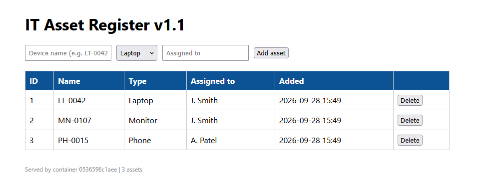
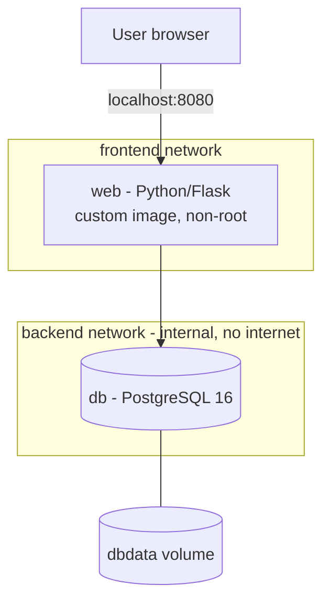

# IT Asset Register: Containerised Two-Tier Web App


A small internal IT tool for tracking devices (laptops, monitors, phones) and who they are assigned to. Built as a hands-on lab to demonstrate **Docker**, **Docker Compose**, container networking, persistent storage and container security practices.



## Architecture



## What this project demonstrates

| Area | Implementation |
|---|---|
| **Custom images** | Dockerfile with dependency layer caching, slim base image, pinned versions |
| **Multi-container apps** | Docker Compose defining the app, database, networks and volumes |
| **Network segmentation** | Database on an `internal` network with no internet access and no published ports |
| **Persistent storage** | Named volume; data survives container rebuilds and redeployments |
| **Security** | App runs as non-root user; secrets kept in `.env` (excluded from Git and image); port bound to localhost only |
| **Reliability** | Health checks on both services; app waits for DB to be healthy; restart policies |
| **Resource control** | Memory limits on each container |
| **CI/CD** | GitHub Actions builds the image and publishes it to GitHub Container Registry on every push |

## Run it yourself

Requires Docker Desktop.

```bash
git clone https://github.com/iM-iUser/docker-asset-register.git
cd docker-asset-register
cp .env.example .env        # then set your own password
docker compose up -d --build
```

Open http://localhost:8080

## Tests I carried out

- **Persistence:** ran `docker compose down` and `up` again; all data retained in the volume.
- **Isolation:** confirmed the database container cannot reach the internet (`ping` fails from the internal network).
- **Zero-data-loss update:** changed the app, rebuilt with `docker compose up -d --build`; only the web container was replaced and data was untouched.
- **Health:** both containers report `healthy` in `docker compose ps`.

## What I learned

- How image layers and build caching work, and how to order a Dockerfile for fast rebuilds
- Container networking: user-defined networks, built-in DNS, internal networks and port publishing
- Why containers are disposable and state belongs in volumes
- Keeping secrets out of source control and out of images

## Roadmap

- [ ] Deploy to Azure using **Terraform**
- [ ] Run on **Azure Kubernetes Service (AKS)**
- [ ] Store secrets in **Azure Key Vault**
- [ ] Automated database backups
