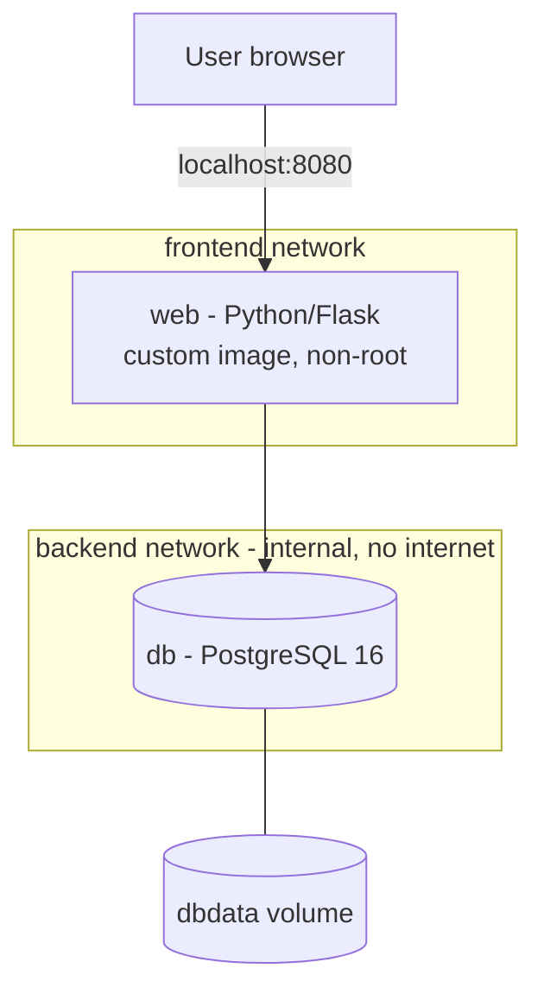

# IT Asset Register: Containerised Two-Tier Web App


[](docs/LAB-GUIDE.md)

A small internal IT tool for tracking devices (laptops, monitors, phones) and who they are assigned to. I built it as a hands-on project to learn **Docker** properly: writing my own image, running a multi-container application with **Docker Compose**, segmenting container networks, keeping data persistent, and automating image builds with **GitHub Actions**.

The same image was later deployed to Azure with Terraform. See [Where this went next](#where-this-went-next).

## 📘 Lab Guide

> [!TIP]
> **The full step-by-step write-up is in the [Lab Guide](docs/LAB-GUIDE.md).**
> It covers how I built each file and why, the tests I ran, the problems I hit and how I fixed them, and the official documentation I used.


## What this project demonstrates

| Area | Implementation |
|---|---|
| **Custom images** | Dockerfile with dependency layer caching, slim base image, pinned versions |
| **Multi-container apps** | Docker Compose defining the app, database, networks and volumes |
| **Network segmentation** | Database on an `internal` network with no internet access and no published ports |
| **Persistent storage** | Named volume; data survives container rebuilds and redeployments |
| **Security** | App runs as a non-root user; secrets kept in `.env` (excluded from Git and the image); port bound to localhost only |
| **Reliability** | Health checks on both services; the app waits for the database to be healthy; restart policies |
| **Resource control** | Memory limits on each container |
| **CI/CD** | GitHub Actions builds the image and publishes it to GitHub Container Registry on every push, tagged by commit |

## Why I built this

Most of my work has been hands-on infrastructure: domain migrations, hybrid identity, Intune rollouts and estate rebuilds. A recurring theme has been environments that are meant to be identical but slowly drift apart, such as a gold build image going out of date while the machines built from it diverge, or having to test an application specifically inside Citrix because the environment it runs in changes how it behaves.

Docker addresses exactly that problem: the environment is defined in a file and rebuilt identically every time. I wanted to learn it by building something realistic rather than only running sample images, so I built a small IT tool with a web front end and a database, and applied the practices I would expect in a production setting.

## Architecture



- **web** is built from my own Dockerfile. It sits on both networks, so it can be reached from the browser and can reach the database.
- **db** runs the official PostgreSQL 16 image, only on the `backend` network, which is `internal`: no internet access and not reachable from outside.
- **dbdata** is a named volume holding the database files, so data survives when containers are removed and recreated.

## Running it yourself

You need **Docker Desktop** (open, showing **Engine running**) and **Git**. See [Prerequisites](docs/LAB-GUIDE.md#prerequisites) for install steps. Run each line separately in PowerShell:

```powershell
git clone https://github.com/iM-MQ/docker-asset-register.git
```

```powershell
cd docker-asset-register
```

```powershell
Copy-Item .env.example .env
```

```powershell
notepad .env
```

Set your own password in `.env`, save and close, then:

```powershell
docker compose up -d --build
```

```powershell
docker compose ps
```

When both containers show `(healthy)`, open **http://localhost:8080**. Stop it with `docker compose stop`.

## The full write-up

| Section | What's in it |
|---|---|
| [What is Docker?](docs/LAB-GUIDE.md#what-is-docker) | Key terms, and containers compared with virtual machines |
| [How I built it](docs/LAB-GUIDE.md#how-i-built-it) | Every file, and the reasoning behind each setting |
| [Tests I carried out](docs/LAB-GUIDE.md#tests-i-carried-out) | Persistence, network isolation, a zero-data-loss update and health checks |
| [The CI/CD pipeline](docs/LAB-GUIDE.md#the-cicd-pipeline) | How images are built, published and tagged by commit |
| [Issues I hit and how I fixed them](docs/LAB-GUIDE.md#issues-i-hit-and-how-i-fixed-them) | Real problems from building this, and how I solved them |
| [References](docs/LAB-GUIDE.md#references) | The official documentation I used |

## Where this went next

I deployed this exact image to Azure as the capstone of my [Terraform Azure Labs](https://github.com/iM-MQ/terraform-azure-labs). **[Lab 05](https://github.com/iM-MQ/terraform-azure-labs/tree/main/lab-05-capstone)** ran it in **Azure Container Apps**, pinned to a commit tag from this pipeline, with the database moved to **Azure Database for PostgreSQL** and the password generated by Terraform and held as a secret. The application code did not change at all between my laptop and Azure.

## Roadmap

| Status | Item |
|---|---|
| ✅ Complete | Containerised two-tier app with Docker Compose |
| ✅ Complete | CI/CD pipeline publishing to GitHub Container Registry |
| ✅ Complete | Deploy to Azure using **Terraform** ([Lab 05](https://github.com/iM-MQ/terraform-azure-labs/tree/main/lab-05-capstone)) |
| 🚧 In progress | Run on **Kubernetes**, locally and on **AKS** ([Kubernetes Labs](https://github.com/iM-MQ/kubernetes-labs)) |
| ⏳ Planned | Store secrets in **Azure Key Vault** |
| ⏳ Planned | Rebuild the back end as a REST API with **FastAPI**, with automated tests in the pipeline |
| ⏳ Planned | Run the app with a production web server (**Gunicorn**) rather than Flask's development server |
| ⏳ Planned | Automated database backups |